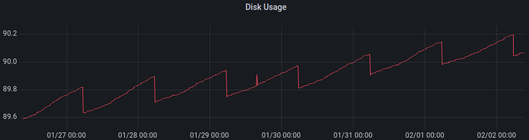

# Tracker Monthly Report

This is a progress update for 02/2022 on infrastructure provided by sudoblock including development of the tracker frontend, indexer, and infrastructure.

The development activities for this period were primarily focused on squashing a number of frontend bugs and preparing for some major upgrades to the backend services and infrastructure deployment. Major events include the redirection of the foundation tracker to the community. With that came a big increase in traffic which now averages ~50 rps over the month including 60k unique visitors (IPs - not necessarily users). The backend has held up fine except for a disruption caused by the cloud provider, brief 5 minute SSL disruptions due to porting to iconblockchain.xyz, and the intentional stopping of the RPC endpoints during the OMM exploit. 

Details of the individual activities are outlined in their respective sections. 

### Summary

Almost every major frontend issue has been resolved along with several feature requests provided by the community. The foundation tracker has been redirected at the community's which initially brought a number of bug reports which were promptly dealt with. We can confidently say that the look and feel of the community tracker is a step above the foundation's at this stage and data integrity issues have been resolved associated with the frontend. In total, about 20 individual issues were handled this month. 

Next month we plan on diving deep into a caching issue which at this point, seems like the only major issue we are facing. We'll also be doing some preparatory work for some major enhancements such as a general way to send transactions to arbitrary contract methods. Details of the January sprint can be found [here](https://github.com/sudoblockio/icon-tracker-frontend/issues/103). 

### [icon-tracker-frontend](https://github.com/sudoblockio/icon-tracker-frontend)

#### Closed Issues

| Number | Name | Status | Created | Notes |
| --- | --- | --- | --- | --- |
| [158](https://github.com/sudoblockio/icon-tracker-frontend/pull/158) | chore(main): release 0.2.10 | closed | 2023-01-26T23:32:56Z | | 
| [157](https://github.com/sudoblockio/icon-tracker-frontend/pull/157) | fix: internal tx tab broken #146 | closed | 2023-01-26T23:25:52Z | | 
| [150](https://github.com/sudoblockio/icon-tracker-frontend/pull/150) | chore(main): release 0.2.9 | closed | 2023-01-24T11:46:51Z | | 
| [149](https://github.com/sudoblockio/icon-tracker-frontend/pull/149) | fix: removed bonders list link #140 | closed | 2023-01-24T11:08:16Z | | 
| [148](https://github.com/sudoblockio/icon-tracker-frontend/pull/148) | fix: address token tx header count #145 | closed | 2023-01-24T11:00:20Z | | 
| [147](https://github.com/sudoblockio/icon-tracker-frontend/pull/147) | fix: wrong decimals in iusdsc token #137 | closed | 2023-01-24T08:14:52Z | | 
| [146](https://github.com/sudoblockio/icon-tracker-frontend/issues/146) | Internal transactions tab not working properly | closed | 2023-01-23T15:03:53Z | | 
| [145](https://github.com/sudoblockio/icon-tracker-frontend/issues/145) | Token transfer count is broken  | closed | 2023-01-23T13:20:09Z | | 
| [144](https://github.com/sudoblockio/icon-tracker-frontend/pull/144) | fix: wrong quantity value in address token tx #137 | closed | 2023-01-21T11:25:32Z | | 
| [143](https://github.com/sudoblockio/icon-tracker-frontend/pull/143) | chore(main): release 0.2.8 | closed | 2023-01-21T11:09:28Z | | 
| [142](https://github.com/sudoblockio/icon-tracker-frontend/pull/142) | fix: wrong bond value #103 | closed | 2023-01-20T18:56:15Z | | 
| [141](https://github.com/sudoblockio/icon-tracker-frontend/pull/141) | fix: address bonders count | closed | 2023-01-20T18:29:08Z | | 
| [140](https://github.com/sudoblockio/icon-tracker-frontend/issues/140) | Bonders list is broken | closed | 2023-01-20T15:19:04Z | | 
| [137](https://github.com/sudoblockio/icon-tracker-frontend/issues/137) | Wrong decimals for IUSDC on tracker | closed | 2023-01-19T23:55:17Z | | 
| [136](https://github.com/sudoblockio/icon-tracker-frontend/pull/136) | fix: address rewards tab count #128 | closed | 2023-01-17T17:04:40Z | | 
| [135](https://github.com/sudoblockio/icon-tracker-frontend/pull/135) | fix: proposal page unregistered address | closed | 2023-01-17T16:50:00Z | | 
| [134](https://github.com/sudoblockio/icon-tracker-frontend/issues/134) | Broken proposal page  | closed | 2023-01-17T13:52:22Z | | 
| [133](https://github.com/sudoblockio/icon-tracker-frontend/issues/133) | Using wrong bond value in bonders tab when address has multiple bonds | closed | 2023-01-15T12:55:24Z | | 
| [132](https://github.com/sudoblockio/icon-tracker-frontend/issues/132) | Fix count in bonders  | closed | 2023-01-15T12:50:46Z | | 
| [131](https://github.com/sudoblockio/icon-tracker-frontend/pull/131) | chore(main): release 0.2.7 | closed | 2023-01-15T12:25:22Z | | 
| [130](https://github.com/sudoblockio/icon-tracker-frontend/pull/130) | fix: bonders listing bug #122 | closed | 2023-01-15T12:24:22Z | | 
| [129](https://github.com/sudoblockio/icon-tracker-frontend/pull/129) | fix: token percent rounding #113 | closed | 2023-01-14T12:35:16Z | | 
| [128](https://github.com/sudoblockio/icon-tracker-frontend/issues/128) | Fix rewards tab count  | closed | 2023-01-14T12:00:19Z | | 
| [127](https://github.com/sudoblockio/icon-tracker-frontend/pull/127) | chore(main): release 0.2.6 | closed | 2023-01-14T11:18:59Z | | 
| [126](https://github.com/sudoblockio/icon-tracker-frontend/pull/126) | fix: voters count in address pages #121 | closed | 2023-01-14T10:32:32Z | | 
| [125](https://github.com/sudoblockio/icon-tracker-frontend/issues/125) | BUG: Amount of IUSDC shown is wrong | closed | 2023-01-14T06:36:48Z | | 
| [124](https://github.com/sudoblockio/icon-tracker-frontend/pull/124) | chore(main): release 0.2.5 | closed | 2023-01-13T14:44:14Z | | 
| [123](https://github.com/sudoblockio/icon-tracker-frontend/pull/123) | fix: method column in address tx #103 | closed | 2023-01-13T13:47:24Z | | 
| [122](https://github.com/sudoblockio/icon-tracker-frontend/issues/122) | Bonders list  | closed | 2023-01-12T18:38:14Z | | 
| [121](https://github.com/sudoblockio/icon-tracker-frontend/issues/121) | Fix voters count  | closed | 2023-01-12T11:06:42Z | | 
| [120](https://github.com/sudoblockio/icon-tracker-frontend/pull/120) | chore(main): release 0.2.4 | closed | 2023-01-11T13:31:39Z | | 
| [119](https://github.com/sudoblockio/icon-tracker-frontend/pull/119) | fix: contracts page status empty bug and removed /v1/contracts api call | closed | 2023-01-11T13:26:05Z | | 
| [118](https://github.com/sudoblockio/icon-tracker-frontend/issues/118) | Get `status` in contracts page to show up right | closed | 2023-01-10T19:24:07Z | | 
| [117](https://github.com/sudoblockio/icon-tracker-frontend/pull/117) | fix: Value UI beautify | closed | 2023-01-10T08:54:58Z | | 
| [116](https://github.com/sudoblockio/icon-tracker-frontend/pull/116) | chore(main): release 0.2.3 | closed | 2023-01-10T08:48:50Z | | 
| [115](https://github.com/sudoblockio/icon-tracker-frontend/pull/115) | fix: internal tx tab empty bug #114 | closed | 2023-01-10T08:47:11Z | | 
| [114](https://github.com/sudoblockio/icon-tracker-frontend/issues/114) | Fix internal Txs tab | closed | 2023-01-09T19:10:40Z | | 
| [113](https://github.com/sudoblockio/icon-tracker-frontend/issues/113) | BUG: Token percentage shown is wrong | closed | 2023-01-09T17:15:04Z | | 
| [112](https://github.com/sudoblockio/icon-tracker-frontend/issues/112) | Feature Request: Add method name in wallet page too for transactions | closed | 2023-01-09T17:12:27Z | | 
| [111](https://github.com/sudoblockio/icon-tracker-frontend/issues/111) | BUG: error on token name when visiting contract page | closed | 2023-01-09T01:51:42Z | | 
| [110](https://github.com/sudoblockio/icon-tracker-frontend/pull/110) | fix: TabsTable onClick handler regression #106 | closed | 2023-01-05T20:21:24Z | | 
| [109](https://github.com/sudoblockio/icon-tracker-frontend/pull/109) | fix: token tabs onClick regression #106 | closed | 2023-01-05T19:55:00Z | | 
| [108](https://github.com/sudoblockio/icon-tracker-frontend/pull/108) | chore(main): release 0.2.2 | closed | 2023-01-05T19:23:36Z | | 
| [107](https://github.com/sudoblockio/icon-tracker-frontend/pull/107) | fix: contract tabs not working - regression #106 | closed | 2023-01-05T19:22:19Z | | 
| [106](https://github.com/sudoblockio/icon-tracker-frontend/issues/106) | Tabs not working  | closed | 2023-01-05T19:17:52Z | | 
| [105](https://github.com/sudoblockio/icon-tracker-frontend/pull/105) | chore(main): release 0.2.1 | closed | 2023-01-04T14:21:52Z | | 

#### Open Issues

| Number | Name | Status | Created | Notes                                              |
| --- | --- | --- | --- |----------------------------------------------------| 
| [161](https://github.com/sudoblockio/icon-tracker-frontend/issues/161) | Cache issue when on an address  | open | 2023-02-01T06:32:12Z | This is the biggest issue we are facing currently. | 
| [160](https://github.com/sudoblockio/icon-tracker-frontend/issues/160) | Add method to internal transactions tab | open | 2023-01-27T00:47:06Z |                                                    | 
| [159](https://github.com/sudoblockio/icon-tracker-frontend/issues/159) | Low count internal Txs jamming API sometimes | open | 2023-01-26T23:38:41Z |                                                    | 
| [156](https://github.com/sudoblockio/icon-tracker-frontend/issues/156) | Allow searching for contract names in search bar | open | 2023-01-26T20:58:49Z |                                                    | 
| [155](https://github.com/sudoblockio/icon-tracker-frontend/issues/155) | Add filters to method column   | open | 2023-01-25T11:04:50Z |                                                    | 
| [154](https://github.com/sudoblockio/icon-tracker-frontend/issues/154) | Create more obvious link for debug trace  | open | 2023-01-24T15:50:13Z |                                                    | 
| [153](https://github.com/sudoblockio/icon-tracker-frontend/issues/153) | Sort tokens drop down based on name (alphabetical)  | open | 2023-01-24T12:30:33Z |                                                    | 
| [152](https://github.com/sudoblockio/icon-tracker-frontend/issues/152) | Update formatting per best practices  | open | 2023-01-24T12:08:20Z |                                                    | 
| [151](https://github.com/sudoblockio/icon-tracker-frontend/issues/151) | Remove duplicate `/api/v1/contracts/<addr>` calls | open | 2023-01-24T12:01:33Z |                                                    | 
| [139](https://github.com/sudoblockio/icon-tracker-frontend/issues/139) | Contract registration refresh  | open | 2023-01-20T14:07:08Z |                                                    | 
| [138](https://github.com/sudoblockio/icon-tracker-frontend/issues/138) | Update react version  | open | 2023-01-20T14:06:01Z |                                                    | 
| [104](https://github.com/sudoblockio/icon-tracker-frontend/issues/104) | Update CI to include version update on release  | open | 2023-01-04T14:11:29Z |                                                    | 
| [103](https://github.com/sudoblockio/icon-tracker-frontend/issues/103) | January Sprint | open | 2023-01-04T12:52:24Z |                                                    | 
| [102](https://github.com/sudoblockio/icon-tracker-frontend/issues/102) | Design new contracts read tab setting up for write tab | open | 2023-01-04T12:52:14Z |                                                    | 
| [101](https://github.com/sudoblockio/icon-tracker-frontend/issues/101) | HANA / ledger wallet integration and POC  | open | 2023-01-04T12:48:22Z |                                                    | 

### [icon-transformer](https://github.com/sudoblockio/icon-transformer)

Work has been slow on the transformer as the majority of bugs were due to frontend issues. We're also starting to rebuild the [icon-extractor](https://github.com/sudoblockio/icon-extractor) which is where all the data originates with certain design patterns still being considered potentially having an impact on the downstream services such as the transformer. There are many  reasons for this rebuild and should be discussed offline. 

#### Closed Issues

| Number | Name | Status | Created | Notes |
| --- | --- |--------| --- | --- |
| [62](https://github.com/sudoblockio/icon-transformer/issues/62) | Fix contract `status` which seems to be overwritten by transformer somewhere  | closed | 2022-12-19T06:56:16Z | | 

#### Open Issues

| Number | Name | Status | Created | Notes |
| --- | --- | --- | --- | --- | 
| [65](https://github.com/sudoblockio/icon-transformer/issues/65) | Missing BTP contracts (internal) in tokens list | open | 2023-01-20T13:58:47Z | | 

### [icon-go-api](https://github.com/sudoblockio/icon-go-api)

#### Open Issues

| Number | Name | Status | Created | Notes                                                                                      |
| --- | --- | --- | --- |--------------------------------------------------------------------------------------------| 
| [26](https://github.com/sudoblockio/icon-go-api/issues/26) | In /addresses/contracts API, 'status' query param not working  | open | 2022-12-14T16:24:09Z | Slated for completion alongside a frontend issue.                                     | 
| [22](https://github.com/sudoblockio/icon-go-api/pull/22) | Add parameterized count to transactions #9 | open | 2022-12-10T00:45:33Z | Started but still needs testing before merging.                                            | 
| [15](https://github.com/sudoblockio/icon-go-api/issues/15) | Integrate with transformer  | open | 2022-11-19T19:22:06Z | May not do.                                                                                | 
| [14](https://github.com/sudoblockio/icon-go-api/issues/14) | Slow query with low number of results and low LIMIT | open | 2022-11-17T19:29:27Z | This turned out to mostly be a frontend bug and can be also averted with frontend changes. | 

### [icon-contracts](https://github.com/sudoblockio/icon-contracts)

Nothing needed here for time being. This repo in general is slated to be partially replaced in the new version by merging into the transformer service. 

#### Open Issues

| Number | Name | Status | Created | Notes |
| --- | --- | --- | --- | --- | 
| [5](https://github.com/sudoblockio/icon-contracts/pull/5) | chore(main): release 0.2.0 | open | 2023-01-13T09:27:02Z | | 
| [4](https://github.com/sudoblockio/icon-contracts/issues/4) | Add sort parameter to /contracts api | open | 2022-12-08T17:37:05Z | | 
| | | | | |

### [icon-governance](https://github.com/sudoblockio/icon-governance)

Work has started on fixing an issue with discovering prep IPs. Will be done by the middle of this upcoming month. 

#### Closed Issues

| Number | Name | Status | Created | Notes |
| --- | --- | --- | --- | --- |
| [2](https://github.com/sudoblockio/icon-governance/pull/2) | chore(main): release 0.1.3 | closed | 2023-01-13T09:19:58Z | | 

#### Open Issues

| Number | Name | Status | Created | Notes |
| --- | --- | --- | --- | --- | 
| [3](https://github.com/sudoblockio/icon-governance/issues/3) | Fix node status | open | 2023-01-13T10:01:23Z | | 

### [icon-tracker](https://github.com/sudoblockio/icon-tracker)

#### Closed Issues

| Number | Name | Status | Created | Notes |
| --- | --- | --- | --- | --- |
| [69](https://github.com/sudoblockio/icon-tracker/issues/69) | Problem with the showing number of voters | closed | 2023-01-12T11:00:33Z | | 

#### Open Issues

| Number | Name | Status | Created | Notes                                              |
| --- | --- | --- | --- |----------------------------------------------------| 
| [72](https://github.com/sudoblockio/icon-tracker/issues/72) | Block query failing for frontend on high page number | open | 2023-01-20T01:18:05Z | Discussed with Eric and still considering options. | 

## Infrastructure 

We have begun planning a migration for the backend to another cloud that will allow us to A, save money, B, increase reliability, and C, most importantly avert a disk space issue. As the chain grows, disks space is going to be an issue that we have to deal with via some redeployment. Currently, the chain is growing by roughly ~30 gb per month with data pulled from prometheus over the last week. 

As you can see, the disk usage was 89.6% at the beginning of the week and ended at roughly 90% after the logs were vacuumed. Given that the disks are roughly 2 TB and that there should be a minimum of 5% free disk space (aggressive but realistically ok), we have about 3-4 months until we should be migrating off this instance type and on to a larger capacity node. With the current cloud provider, the costs are very high to upgrade to larger volumes. Thus, we are talking with multiple cloud providers to see what kind of options are available for 4 TB sized volumes. 

Currently, we anticipate being able to at least come in at the same budget after a migration while also being able to have access to larger disks. Pricing is still being discussed and will report further next month but early estimates suggest that there will be a cost reduction. We think the migration should start to take place in about 2-3 months and will take about 1-2 months to complete. 

The new setup will most likely be exclusively kubernetes on bare metal which will also negate our need to run VMs as is the case in the current setup. This migration will also increase reliability of the clusters. 

Initial development has already begun with laying out the core components needed for deployment including a general shift to using kubernetes operators over static deployments, something that is broadly considered best practice these days as operators have matured dramatically over the last couple of years. 

## Downtime Incidents

| Date | Total Downtime | Cause                                                                                                                                                                                                                                         | Resolution                                               |
|------|---------------|-----------------------------------------------------------------------------------------------------------------------------------------------------------------------------------------------------------------------------------------------|----------------------------------------------------------|
| 1/7  | ~10 min       | Cloud provider maintenance period that we had thought we were prepared for but had one missing DNS record not properly switched over (API). Ultimately split blame.                                                                           | Got alarm and promptly switched record.                  |
| 1/10 | 2 x ~2 min    | Somehow got SSL errors when activating the iconblockchain.xyz endpoints. Believe this will require some scheduled maintenance by letting the community know. Believe everything is fine but just needs some cloudflare caching to be updated. | Got alarms and promptly switched back routes in cluster. |
| 1/22 | 2 hours       | OMM Exploit intentional disruption.                                                                                                                                                                                                           | Turned off and on RPC endpoints.                         |

> Report generated with [tackle](https://github.com/robcxyz/tackle-box)